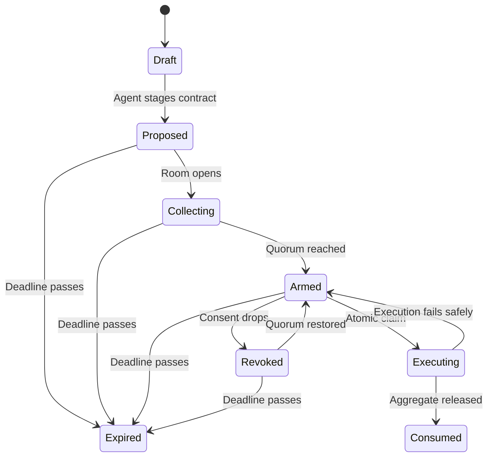
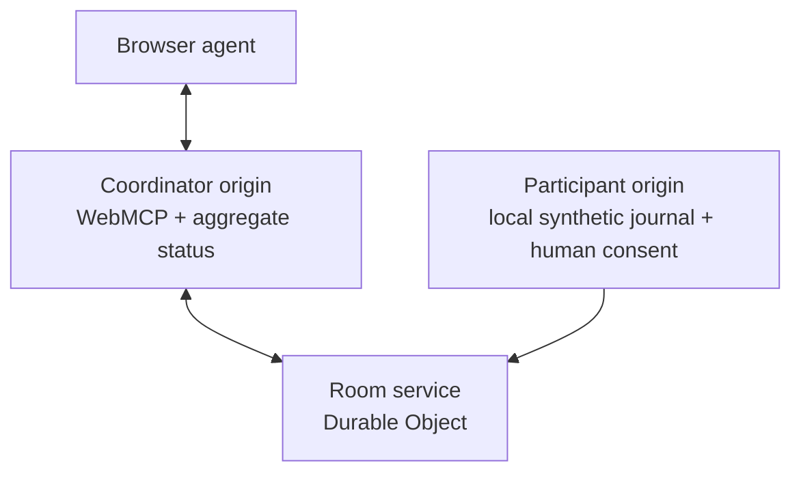

# Quorum

**A tool that exists only while the people agree.**

Quorum is a collective-consent room for agent capabilities, built for the [OpenAI WebMCP Challenge](https://openai.com/webmcp-challenge/). An agent may propose one exact, bounded aggregate question. Humans review the same immutable contract and consent independently. Only while the configured quorum is live does the coordinator page publish a zero-parameter, one-use [WebMCP](https://github.com/webmachinelearning/webmcp) tool that can answer it.

Withdraw consent before execution and the tool disappears. Invoke it successfully and the caller receives only the approved aggregate and a receipt; the capability is then consumed.

The challenge demo uses four synthetic participant journals and asks:

> How many consenting participants recorded dizziness within 48 hours after a medication dose change?

Healthcare is the first adapter. The product is **collective consent as the interface**.

## Why WebMCP

Most agent-facing applications expose a standing menu of generic tools. A permanent `query_cohort(question)` capability would let a caller keep changing the question and repeatedly interrogating private records.

Quorum reverses that model. Before quorum, there is no answer capability to invoke. When enough people consent, the page dynamically registers one tool bound to the approved question hash and consent version. Withdrawal, expiry, or successful execution unregisters it.

The WebMCP tool inventory is therefore not merely an API surface. It is the room's live authority state.

| Conventional agent tool | Quorum capability |
| --- | --- |
| Permanently registered | Exists only during valid quorum |
| Accepts a caller-selected query | Bound to one human-approved contract |
| Authorized by one account | Authorized by a group threshold |
| Reusable | Zero-parameter and one-use |
| Returns general records or results | Returns one permitted aggregate and receipt |

## Demo

The guided demo follows one complete capability lifecycle:

1. The agent calls `describe_cohort` and learns what aggregate questions are permitted—without receiving records.
2. The agent calls `propose_count_question` to stage the dizziness-after-dose-change question.
3. Four humans, represented by separate synthetic participant sessions, review the exact question, fields, threshold, expiry, and use limit.
4. When three participants consent, the coordinator enters `Armed` and registers `answer_dizziness_after_dose_change_once`.
5. One participant withdraws. The room drops below quorum and the answer tool disappears. Restoring consent registers it again.
6. The agent invokes the tool with no arguments. The room atomically revalidates authority, returns the approved count and receipt, marks the room `Consumed`, and unregisters the tool permanently.

`Reset demo` creates a new room. It never revives a consumed capability.

## Consent contract

Participants do not consent to a natural-language prompt that the caller may reinterpret. They consent to a canonical contract containing:

- the exact descriptive question
- the local field categories used to evaluate it
- the aggregate type (`count` only)
- the required number of consents
- the minimum number of contributors
- the expiration time
- the maximum number of successful uses (`1`)

The demo contract is equivalent to:

```json
{
  "questionId": "dizziness_after_dose_change_48h",
  "aggregate": "count",
  "event": "medication_dose_change",
  "symptom": "dizziness",
  "windowHours": 48,
  "fields": [
    "medicationEvents[].doseChangedAt",
    "symptoms[].name",
    "symptoms[].recordedAt"
  ],
  "requiredConsents": 3,
  "minimumContributors": 3,
  "expiresAt": "<ISO-8601 room expiry>",
  "maxUses": 1
}
```

The application canonicalizes the complete contract, including its expiry, and computes a SHA-256 `questionHash`. Every consent and contribution is bound to that hash. Changing any term invalidates prior consent and requires a new proposal.

## Capability lifecycle



`Revoked` is reversible only while the same contract remains valid and unexpired. `Consumed` and `Expired` are terminal.

Consent can be withdrawn until execution is atomically claimed. If withdrawal reaches the room service first, execution fails. If execution is claimed first, the approved aggregate may be released and the capability becomes consumed.

## WebMCP tools

| Availability | Tool | Inputs | Result |
| --- | --- | --- | --- |
| Always | `describe_cohort` | None | Eligible cohort size, allowed field categories, aggregate type, quorum bounds, and demo question catalog. No records. |
| Always | `propose_count_question` | Constrained question identifier and expiry | Stages one immutable contract and returns its `questionHash`. It does not evaluate records. |
| Always | `get_quorum_status` | None | Room state, question hash, required and current consent counts, consent version, expiry, and whether the answer tool should exist. No identities or individual votes. |
| Armed only | `answer_dizziness_after_dose_change_once` | None | Approved aggregate, contributor count, question hash, consent version, execution time, and receipt ID. |

The consequential tool is registered with the current WebMCP imperative API:

```ts
const registration = new AbortController();

await document.modelContext.registerTool(answerTool, {
  signal: registration.signal,
});

// Withdrawal, expiry, or successful execution:
registration.abort();
```

The room service remains authoritative. If the browser briefly retains a stale tool registration, its execution handler still rejects an invalid, expired, changed, or consumed room.

## Human authority

Consent, decline, withdrawal, and restoration are human-only UI actions. They are deliberately not WebMCP tools.

An agent cannot:

- consent or withdraw for a participant
- discover participant join credentials
- view an individual journal, contribution, or vote
- edit an armed proposal
- lower the quorum or contributor threshold
- extend the expiry
- add parameters to the answer tool
- retry a consumed capability

## Architecture

The coordinator and participant applications run on separate origins. The agent-facing coordinator never renders participant journals or join credentials.



The repository is a TypeScript monorepo:

```text
apps/
  coordinator/       Agent-facing room and WebMCP registration
  participant/       Human-only consent session and local evaluation
  room-service/      Cloudflare Worker and one Durable Object per room
packages/
  protocol/          Contracts, schemas, hashing, receipts, and state types
  demo-data/         Synthetic journals and deterministic local evaluator
  ui/                Shared presentational components and design tokens
tests/
  e2e/               Full lifecycle and adversarial browser tests
```

The Durable Object serializes room transitions and provides the atomic execution claim. Coordinator updates arrive over a WebSocket so tool registration follows room authority in real time.

## Authority invariants

The implementation must preserve these rules even when the UI or network is stale:

1. The proposal is immutable after the first consent.
2. Every consent and contribution is bound to `questionHash` and `consentVersion`.
3. The coordinator receives aggregate status, never participant identities, links, journals, votes, or contributions.
4. The answer handler revalidates the hash, consent version, quorum, contributor minimum, expiry, room state, and remaining use count inside the atomic execution claim.
5. At most one invocation can move an `Armed` room to `Executing`.
6. A failed invocation consumes nothing and may return to `Armed` only if authority remains valid.
7. A successful invocation records a receipt, moves the room to `Consumed`, purges temporary contributions, and unregisters the answer tool.
8. The server rejects duplicate or stale calls even if an agent discovered the tool before it was removed.

## Privacy and threat boundary

- All journals and identities in the challenge demo are synthetic.
- A raw journal remains in its participant browser session and is never uploaded to the room service.
- The participant client evaluates the approved contract locally and, after consent, submits one pseudonymous, query-bound `0` or `1` contribution.
- The room service temporarily processes those contributions so it can support withdrawal and compute the count. It exposes only aggregate status to the coordinator and only the thresholded aggregate after authorized execution.
- Contributions are purged when the room is consumed or expires.
- The coordinator page and WebMCP caller never receive participant-level records, identities, votes, or answers.

This prototype demonstrates consent-scoped capability publication, not cryptographic secure aggregation. It does not claim anonymity from the hosting provider, zero-knowledge computation, HIPAA compliance, production participant authentication, or protection from a malicious deployment operator. It is not medical advice.

## Technology

- TypeScript
- React and Vite
- Cloudflare Workers and Durable Objects
- WebSockets for live room state
- Zod for shared runtime contracts
- Web Crypto for SHA-256 contract hashes
- Vitest and Playwright
- WebMCP via `document.modelContext`

## Run locally

Requirements: Node.js 20+ and pnpm.

```bash
corepack enable
pnpm install
pnpm dev
```

Local development starts three distinct origins:

- coordinator: `http://localhost:5173`
- participant: `http://localhost:5174`
- room service: `http://localhost:8787`

Then run:

```bash
pnpm test
pnpm test:e2e
pnpm build
```

Use a browser with WebMCP enabled for local tool testing. Validate the hosted build in ChatGPT's in-app browser before submission.

## Required acceptance tests

The project is not demo-ready until these scenarios pass:

1. The answer tool is absent below quorum.
2. Reaching quorum registers exactly one zero-parameter answer tool.
3. Withdrawal below quorum unregisters it immediately.
4. Calling a stale discovered tool after withdrawal is rejected by the room service.
5. Restoring quorum re-registers the tool against the current consent version.
6. Two concurrent invocations produce exactly one aggregate and one receipt.
7. Successful execution consumes the room and removes the tool.
8. Expiry removes the tool and prevents execution.
9. Changing the contract invalidates every prior consent.
10. The coordinator DOM, network responses, and WebMCP outputs contain no participant journal, join credential, identity, vote, or contribution.
11. Ordinary browser inspection cannot recover participant records from the coordinator origin.
12. Resetting the demo creates a fresh room rather than reopening a consumed one.

## Challenge scope

For the OpenAI WebMCP Challenge, Quorum intentionally includes:

- one aggregate type: `count`
- one synthetic healthcare cohort
- one approved question
- four participant sessions
- a three-person quorum
- one successful use
- no real healthcare data or external integrations

Additional industries, arbitrary questions, production identity, and cryptographic secure aggregation are out of scope for this submission.

## License

MIT. See [LICENSE](LICENSE).
